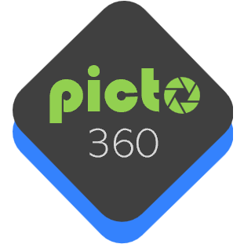

 

    

# Picto360: Application d'annotation d'image

> **Page web du projet (IFT3150):** https://ceduni.github.io/picto360

## Description du projet 

Ce projet est une collaboration avec [École en Réseau](https://eer.qc.ca/) et consiste à développer une application pédagogique permettant d'enrichir des images panoramiques et 360 avec des annotations diverses et interactives.

👀[Exemple d'annotation de photos 360 (prise avec un drone)](https://www.thinglink.com/scene/1800248329951511396)

### Problématique

<!-- TODO -->

### Proposition

<!-- TODO -->
 
#### Objectifs 

<!-- TODO -->

#### Fonctionnalités

<!-- TODO -->

## 📅 Échéancier

> Début du projet: 6 mai 2024  
> Fin du projet: 19 aout 2024

Le développement du projet sera divisé en plusieurs phases:

### Phase 1: Élaboration des exigences

- Semaine 1
- Semaine 2

### Phase 2: Prototypage et conception

- Semaine 3
- Semaine 4
- Semaine 5
- Semaine 6

### Phase 3: Développement 

- Semaine 7
- Semaine 8
- Semaine 9
- Semaine 10
- Semaine 11
- Semaine 12

### Phase 4: Tests & Rapports

- Semaine 13
- Semaine 14
- Semaine 15
- Semaine 16

Le suivi du projet est présenté dans le fichier [**TIMELINE**](TIMELINE.md).

## 🌐 Infrastructure

L'infrastructure de l'application est basée sur...

<!-- TODO -->

# 📘 Documentation

- [Dossier Drive](https://drive.google.com/drive/u/1/folders/12ap4jNxMDa4FnayR46Pu2auJaNviNHCZ): Contient la documentation du projet
- [Wiki](https://github.com/ceduni/picto360/wiki): Contient la documentation de l'application et de l'infrastructure développée (Services, API, Base de données...)

# 🗂️ Organisation

Les dossiers du répertoire sont organisés comme suit:

<!-- TODO -->

# 🌟 Contribution

Le projet est supervisé par [Louis-Edouard LAFONTANT](mailto:louis.edouard.lafontant@umontreal.ca).

## Contributeurs

- Mathis MORRA-FISCHER [@Mathiiis](https://github.com/Mathiiis)
- Tarik BENAKEZOUH [@TBAce11](https://github.com/TBAce11)
